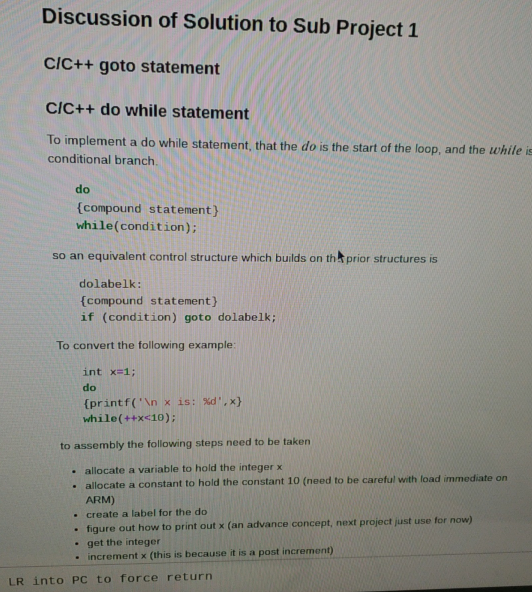
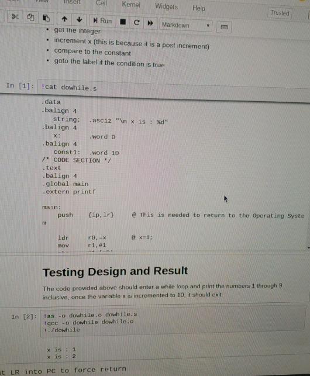
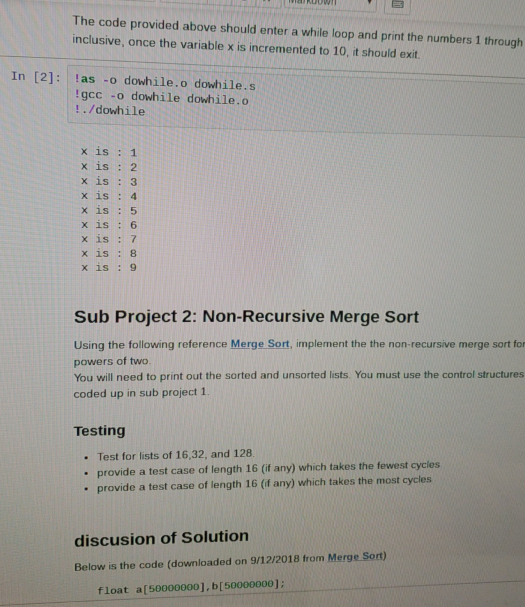

# Architect-Project-1
-my jupyter notebook decided to crash on me so I decided to write down my documentation here. 

To learn arm assembly, writing in arm, troubleshooting arm, building.

  <b>The purpose of recursive Merge Sort:</b>

This merge sort calls for two lists by breaking the array into two. It then orders them separately  using a recursive call to order the subarrays, so that then it can be two ordered list. Once ordered,it merges the lists and returns one ordered list. We can see how it sorts it here with the use of L = ; and R = ;

<b>The purpose of Iterative/Non-Recursive Mergesort:</b>

Trying to figure out an effective way to sort out a list of 16, 32, 128 with a few number of cycles.
This way it'll cut out time for us and work on our raspberry pi. This focuses on loops and N iterations
if the loop is i < n (essentially) then the loop will continue to keep going and sorting the list; however
once it is i >= n the loop will end because the loop has reached all N iterations. It sorts it as well. We can
see how it does it here with the use k = ;

# Sub Project 1 Control Structure
* Code up a C/C++ Goto statement
* Code up if then else statement, use the goto statement you just in the solution 
** ( I used the goto to get the number 3!)
* Code up a x thenbody : else body
* Code up a do while condition

# Non-Recursive Merge Sort
* implement the non-recursive merge sort for powers of two 
* you will need to print out the sort and unsorted lists. You must use the control structures you coded up in sub project 1

## Testing 
* for lists of 16,32,128
* provide a test case of length 16 (if any) which takes the fewest cycles
* provide a test case of length 16 (if any) which takes the most cycles

# Sub Project 3 Recursive Merge Sort 
Using the Merge sort and the control structures coded up in sub project 1 repeat the testing of sub problem 2 for the recursive merge sort

# How it functions on Jupyter Notebook
So as mentioned above, I cannot open up my Jupyter Notebook at the moment due to a faulty update. I however have some screenshots from when it did work, I will reference them below

# Youtube video
Processing!
